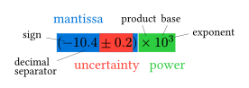
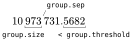
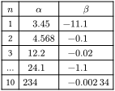
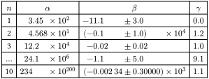

# $Z\cdot e^{ro}$


_Advanced scientific number formatting ._

[](https://typst.app/universe/package/zero)
[](https://github.com/Mc-Zen/zero/actions/workflows/run_tests.yml)
[](https://github.com/Mc-Zen/zero/blob/main/LICENSE)


- [Introduction](#introduction)
- [Quick Demo](#quick-demo)
- [Features](#features)
- [Table alignment](#table-alignment)
- [Zero for packages](#zero-for-packages)

## Introduction

Proper formatting of numbers requires some love for detail to guarantee a readable and clear output. This package provides tools to ensure consistent formatting and follow established practice. Key features are
- **standardized** formatting,
- digit **grouping**, e.g., $299\,792\,458$ instead of $299792458$,
- **plug-and-play** number **alignment in tables**
- quick scientific notation, e.g., `"2e4"` becomes $2\cdot10^4$,
- symmetric and asymmetric **uncertainties**,
- rounding,
- some specials for package authors,
- and localization?. 

A number in scientific notation consists of three parts of which the latter two are optional. The first part is the _coefficient_ that may consist of an _integer_ and a _fractional_ part. In many fields, values are not known exactly and the corresponding _uncertainty_ is then given after the coefficient. Lastly, to facilitate reading very large or small numbers, the coefficient may be multiplied with a _power_ of 10 (or another base). 

The anatomy of a formatted number is shown in the following figure.

<p align="center">
  
</p>

For generating formatted numbers, *Zero* provides the `num` type along with the types `coefficient`, `uncertainty`, and `power` that allow for fine-grained customization with `show` and `set` rules. 

## Quick Demo

| asd | asd|
|-----|----|
| `#num[1.2e4]`        | $1.2\cdot 10^4$  |
| `#num[-5e-4]`        | $-5\cdot 10^{-4}$|
| `#num[9.81+-.01]`    | $9.81\pm 0.01$  |
| `#num[9.81+0.02-.01]`| $9.81^{+0.02}_{-0.01}$|
| `#num[9.81+-.01e2]`      | $(9.81\pm0.01)\cdot 10^2$|


## Features
### Digit grouping

Digit grouping is important for keeping large figures readable. It is customary to separate thousands with a thin space, a dot, comma or an apostrophe (however, we discourage using a dot or a comma to avoid confusion since both are used for decimal markers in many countries). The separator can be configured via the `group-sep` option. 


<p align="center">
  
</p>

By default, both the integer and the fractional part are split into groups of three, starting at the decimal marker. The size of the groups can be configured with `group-size`. Four-digit numbers are often not grouped at all since they can still be read easily. The option `group-threshold` controls the _least_ number of digits for digit grouping to kick in. 

Digit grouping can be turned off altogether with `group-digits: false`. 

### Specifying uncertainties

There are two main ways of specifying uncertainties:
- Applying an uncertainty to the last significant digits using parentheses, e.g., `2.3(4)`,
- Denoting an absolute uncertainty, e.g., `2.3+-0.4` becomes $2.3\pm0.4$. 

Zero supports both and can convert between these two, so that you can pick the displayed style independently from the input style. 

How do uncertainties interplay with exponents? The uncertainty needs to come first and the exponent applies to both the mantissa and the uncertainty, e.g., `num("1.23+-.04e2")` becomes

$$ (1.23\pm0.04)\cdot 10^2 $$

Note that the coefficient is now put in parentheses to disambiguate the application of the power. 

In some cases, the uncertainty is asymmetric which can be expressed via `num("1.23+0.02-0.01")`

$$ 1.23^{+0.02}_{-0.01} $$

## Table alignment

In scientific publication, presenting large amounts of numbers in a readable fashion is a high discipline. A good starting point is to align numbers in a table at the decimal marker. With _Zero_, this can be accomplished by using the `ztable`. This is a wrapper for the built-in `table` which features an additional argument `format` which takes an array of `none` or `auto` values to turn on number alignment for specific columns. 


```typ
#ztable(
  columns: 3,
  align: center,
  format: (none, auto, auto),
  $n$, $α$, $β$,
  [1],   [3.45],  [-11.1],
  ..
)
```

Non-number entries (e.g., in the header) are automatically recognized in some cases and will not be aligned. In ambiguous cases, adding a leading or trailing space tells _Zero_ not to align this cell, for example `[Angle ]` instead of `[Angle]`. 


<p align="center">
  
</p>

The numbers are not only aligned at the decimal point but also at the uncertainty and exponent part. 


<p align="center">
  
</p>


## Zero for packages
